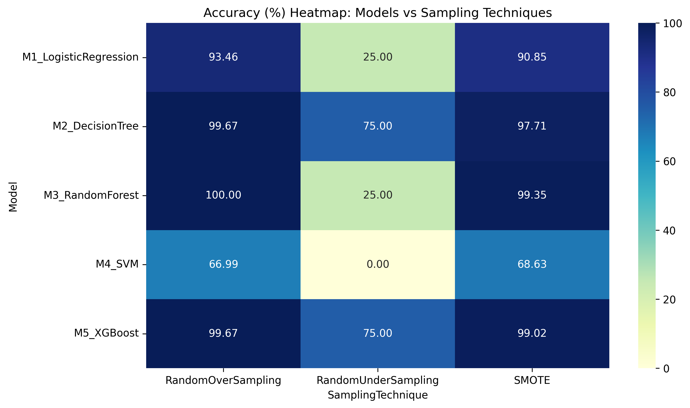
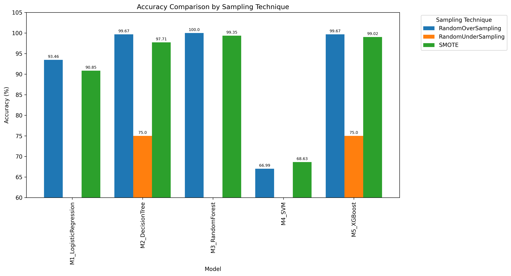

# Credit Card Fraud Detection – Sampling Techniques Comparison

## 📌 Project Overview
This project evaluates the impact of different **sampling techniques** on the performance of machine learning models for imbalanced datasets.  
The dataset used is `Creditcard_data.csv`, where the target variable is `Class` (fraud vs non-fraud).

We applied multiple resampling methods and trained five ML models to compare accuracy.

---

## ⚙️ Models Used
- Logistic Regression
- Decision Tree
- Random Forest
- Support Vector Machine (SVM)
- XGBoost

---

## 🧪 Sampling Techniques
- Random Under Sampling  
- Random Over Sampling  
- Random Under Sampling (imblearn)  
- Random Over Sampling (imblearn)  
- SMOTE  

---

## 📊 Accuracy Comparison Table
The final accuracy results are stored in:

- [results/results_matrix.csv](results_matrix.csv) → **Click to view full table**

Example (rounded values):

| Model                | RandomUnderSampling | RandomOverSampling | RandomUnderSampling_imblearn | RandomOverSampling_imblearn | SMOTE |
|----------------------|---------------------|-------------------|------------------------------|-----------------------------|-------|
| M1_LogisticRegression| 25.00              | 93.46             | 25.00                        | 93.46                       | 90.85 |
| M2_DecisionTree      | 75.00              | 99.35             | 75.00                        | 99.35                       | 97.71 |
| M3_RandomForest      | 25.00              | 100.00            | 25.00                        | 100.00                      | 99.35 |
| M4_SVM               | 0.00               | 66.99             | 0.00                         | 66.99                       | 68.63 |
| M5_XGBoost           | 75.00              | 99.67             | 75.00                        | 99.67                       | 99.02 |

---

## 🏆 Best Sampling Technique per Model
- **M1 Logistic Regression** → Random Over Sampling (93.46%)  
- **M2 Decision Tree** → Random Over Sampling (99.35%)  
- **M3 Random Forest** → Random Over Sampling (100%)  
- **M4 SVM** → SMOTE (68.63%)  
- **M5 XGBoost** → Random Over Sampling (99.67%)  

---

## 📈 Visualizations

### Heatmap

### Bar Graph

---

## 🚀 Conclusion
- **Random Over Sampling** consistently gave the highest accuracy for most models.  
- **SMOTE** improved SVM performance compared to other techniques.  
- Decision Tree, Random Forest, and XGBoost achieved near-perfect accuracy with oversampling methods.  

This analysis highlights the importance of choosing the right sampling technique when dealing with imbalanced datasets.
